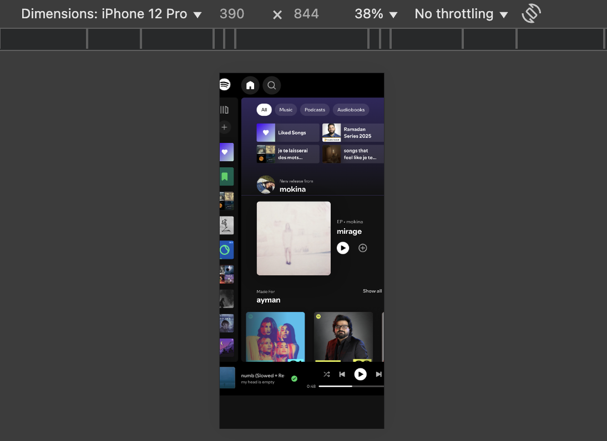

# responsify 🎧

spotify but responsive. \
teaching myself web dev and avoiding tutorial hell.

### stack:

- html
- css (grid / flexbox)
- vanilla js

\

reference image: current spotify iphone reponsiveness
